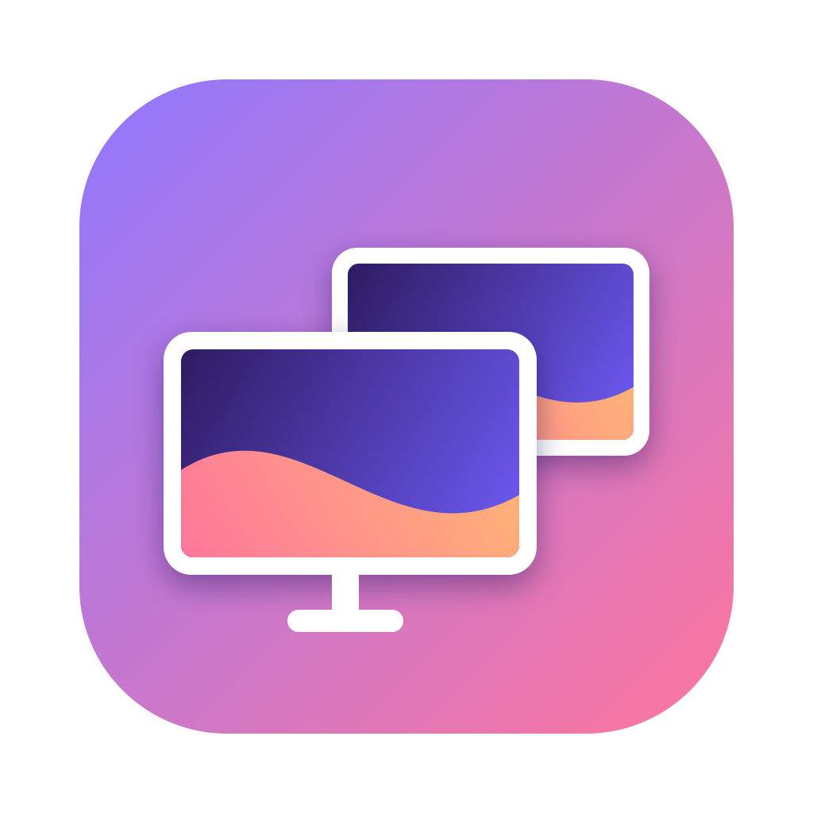
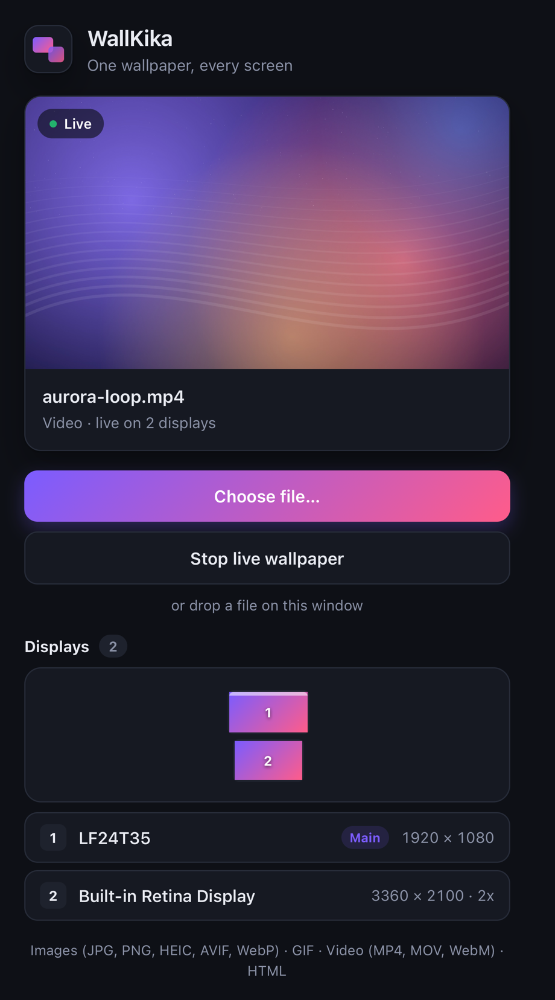
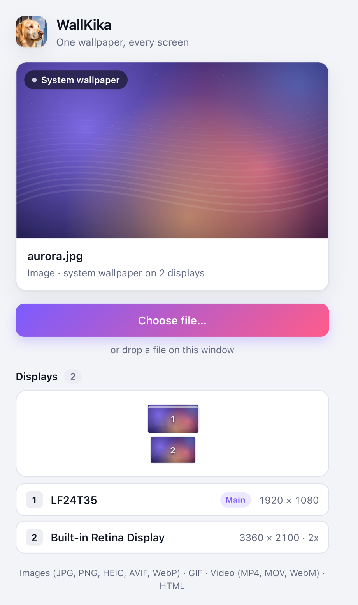
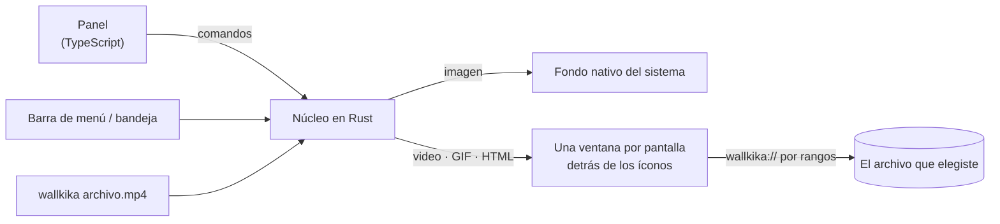

<p align="center">
  <a href="README.md">English</a> · <b>Español</b>
</p>

<p align="center">
  
</p>

<h1 align="center">WallKika</h1>

<p align="center">
  <b>Un fondo, todas tus pantallas.</b><br>
  Elige una imagen, un GIF, un video o una página HTML y WallKika lo pone detrás de los íconos del escritorio en cada pantalla, en loop infinito.
</p>

<p align="center">
  
  
  
  
</p>

<p align="center">
  <a href="../../releases/latest/download/WallKika-macOS.zip"></a>
  <a href="../../releases/latest/download/WallKika-Windows-x64.exe"></a>
  <a href="../../releases/latest/download/WallKika-Linux-x86_64.AppImage"></a>
</p>

<p align="center">
  <sub>Sin instalador: descargas, abres y listo. macOS universal (Apple Silicon + Intel) · Windows 10/11 x64 · Linux x86_64 · <a href="../../releases">todas las versiones</a></sub>
</p>

<p align="center">
  
  &nbsp;&nbsp;
  
</p>

## Funciones

- **Todas las pantallas, automáticamente.** Replica el fondo en todas las pantallas conectadas, incluso con combinaciones como Retina + 1080p. Si conectas un monitor, en 2 segundos ya tiene el fondo.
- **Videos que nunca se cortan.** MP4, M4V, MOV y WebM en loop infinito, sin sonido y detrás de tus íconos. Da igual si el video dura 2 minutos o 2 horas: se reproduce por streaming, nunca se carga entero en memoria.
- **Imágenes sin consumo.** JPG, PNG, HEIC, AVIF, WebP, BMP y TIFF usan el fondo nativo del sistema, así que no gastan CPU y siguen ahí aunque cierres la app.
- **GIFs y páginas web.** Usa un GIF o cualquier página HTML (un reloj, un shader, un dashboard) como fondo animado. Las páginas corren aisladas.
- **No molesta.** Controles en la barra de menú o bandeja, arrastrar y soltar, y línea de comandos (`wallkika video.mp4`). Cerrar el panel no cierra la app, y el último fondo animado vuelve al abrirla.
- **Liviana.** Unos 25 MB de RAM para el núcleo y cerca del 12% de un núcleo de CPU con un video 1080p en dos pantallas (Apple M2).

## Descarga

WallKika es portable: no hay nada que instalar. Descarga el archivo de tu sistema con los botones de arriba o desde [Releases](../../releases).

| Sistema | Archivo | Primera vez |
| --- | --- | --- |
| macOS 13+ | `WallKika-macOS.zip` | Descomprime y abre `WallKika.app`. Si quieres conservarla, muévela a **Aplicaciones**. La app todavía no está notarizada por Apple: si macOS la bloquea, ve a **Ajustes del Sistema → Privacidad y seguridad → Abrir igualmente**. |
| Windows 10 / 11 | `WallKika-Windows-x64.exe` | Doble clic para abrirla; si quieres, ánclala a la barra de tareas o al Inicio. SmartScreen puede avisar que el editor es desconocido: **Más información → Ejecutar de todas formas**. Necesita Microsoft Edge WebView2, que ya viene en Windows 11 y en Windows 10 actualizado. |
| Linux | `WallKika-Linux-x86_64.AppImage` | `chmod +x WallKika-Linux-x86_64.AppImage` y ejecútala. Algunas distribuciones necesitan `libfuse2` para abrir AppImages. |

## Estado: v0.1.0 preview

| Plataforma | Imágenes fijas | Fondos animados | Probado en hardware real |
| --- | --- | --- | --- |
| macOS 13+ | ✅ | ✅ | ✅ macOS 27, Apple M2, dos pantallas con distinta densidad |
| Windows 10 / 11 (incluye 24H2) | 🧪 | 🧪 | Todavía no: compila sin errores, se buscan testers |
| Linux (GNOME, KDE, XFCE, Cinnamon, MATE, LXQt, Sway, Hyprland…) | 🧪 | 🧪 X11 / XWayland | Todavía no: compila sin errores, se buscan testers |

Si usas Windows o Linux, tu ayuda probando vale oro. Mira [Cómo contribuir](#cómo-contribuir).

## Cómo funciona



Las imágenes fijas usan la API nativa de cada sistema: `NSWorkspace` en macOS, `IDesktopWallpaper` en Windows, y en Linux `gsettings`, `plasma-apply-wallpaperimage`, `xfconf-query`, `swww` o `feh`, según el escritorio.

Los fondos animados son ventanas sin bordes, una por pantalla, ubicadas donde vive el fondo del escritorio:

- **macOS**: el nivel de ventana de escritorio de CoreGraphics, en todos los Spaces y sin capturar el mouse.
- **Windows**: dentro del `WorkerW` de Explorer en el escritorio clásico, o dentro de `Progman` justo debajo de los íconos en el escritorio de 24H2+.
- **Linux**: ventanas X11 de tipo `_NET_WM_WINDOW_TYPE_DESKTOP`; las sesiones Wayland corren con XWayland.

Los archivos llegan a esas ventanas por un protocolo propio, `wallkika://`, que sirve rangos exactos de bytes. Por eso los videos enormes se reproducen fluidos.

## Compilar desde el código

1. Instala [Node.js](https://nodejs.org) 20+, [Rust](https://rustup.rs) y los [requisitos de Tauri](https://v2.tauri.app/start/prerequisites/) para tu sistema. La versión de Rust está fijada en `rust-toolchain.toml`; ejecuta `rustup toolchain install` dentro del proyecto para obtenerla.
2. En Linux, instala también los plugins de GStreamer para video: `gstreamer1.0-plugins-good`, `gstreamer1.0-plugins-bad` y `gstreamer1.0-libav`.
3. Compila:

```bash
npm install
npm run tauri dev     # modo desarrollo
npm run package       # versión portable para tu sistema, en release/
```

En macOS, `npm run package` genera una app universal, así que necesita los dos targets de Rust: `rustup target add aarch64-apple-darwin x86_64-apple-darwin`. Con `MAC_TARGET=aarch64-apple-darwin` compila solo para Apple Silicon, más rápido.

## Uso

- **Panel**: haz clic en **Choose file…** o arrastra un archivo a la ventana.
- **Barra de menú / bandeja**: elige un fondo, quita el fondo animado o sal de la app.
- **Línea de comandos**: `wallkika /ruta/al/video.mp4` le pasa el archivo a la instancia abierta.

La configuración se guarda en la carpeta de la app (`~/Library/Application Support/com.cristiandjr.wallkika/` en macOS). Los logs están en `~/Library/Logs/com.cristiandjr.wallkika/`.

## Estructura del proyecto

```
src/
  panel/                panel de control (HTML, CSS, TypeScript)
  wallpaper/            renderer que se carga en cada ventana de fondo
  shared/api.ts         puente tipado con los comandos y eventos de Rust
src-tauri/src/
  engine.rs             decide nativo o animado y maneja las ventanas por pantalla
  display.rs            lista de pantallas y detección de cambios
  protocol.rs           protocolo wallkika:// (rangos de bytes + lista de permitidos)
  platform/             macos.rs · windows.rs · linux.rs
  commands.rs · tray.rs · settings.rs · media.rs · error.rs
scripts/
  package.sh            versión portable para el sistema actual
  cross-check.sh        revisa los backends de Windows y Linux desde cualquier sistema
  macos/                herramientas de diagnóstico (niveles de ventana, fondo actual)
.github/workflows/
  release.yml           compila todas las plataformas y publica la release en GitHub
```

## Seguridad

- Las ventanas de fondo solo pueden leer los archivos que elegiste (y la carpeta de un fondo HTML) a través de `wallkika://`. Todo lo demás se rechaza.
- Los fondos HTML corren en un iframe aislado, sin acceso a la API de la app.
- Content Security Policy estricta, permisos mínimos de Tauri, sin contenido remoto y sin telemetría.

## Hoja de ruta

- [ ] Todos los formatos de video (MKV, AVI, WMV, FLV…) convirtiéndolos automáticamente con ffmpeg
- [ ] Pruebas en hardware con Windows y Linux
- [ ] Notarización de Apple y firma de código en Windows, actualizaciones automáticas
- [ ] Abrir al iniciar sesión
- [ ] Un fondo distinto por pantalla y modos de ajuste (cubrir, contener, estirar)
- [ ] Listas de reproducción y horarios
- [ ] Pausar con apps en pantalla completa o con batería
- [ ] Decodificadores nativos (AVPlayer, Media Foundation, mpv) que decodifiquen una sola vez para todas las pantallas
- [ ] Soporte de Wayland layer-shell
- [ ] Interfaz en español

## Cómo contribuir

Los issues y pull requests son bienvenidos, sobre todo de quienes usan Windows y Linux.

```bash
npm install
npm run tauri dev                                         # modo desarrollo
cd src-tauri && cargo fmt && cargo clippy --all-targets && cargo test
npm run build && npm run check:cross                      # frontend + revisión Windows/Linux
```

Estilo de código: todo en inglés, nombres que se expliquen solos y comentarios solo cuando algo no es obvio (una línea).

### Publicar una versión

1. Actualiza `version` en `package.json` y `src-tauri/Cargo.toml`.
2. Sube un tag: `git tag v0.2.0 && git push origin v0.2.0`.
3. El [workflow de Release](.github/workflows/release.yml) compila macOS, Windows y Linux y los publica en Releases. Los botones de descarga siempre apuntan a la última versión.

## Apoya el proyecto

Si WallKika te resulta útil, puedes apoyar su desarrollo:

- **Mercado Pago** (Argentina) · alias **`cristiandjr.mp`**

## Licencia

[MIT](LICENSE) © 2026 cristiandjr
