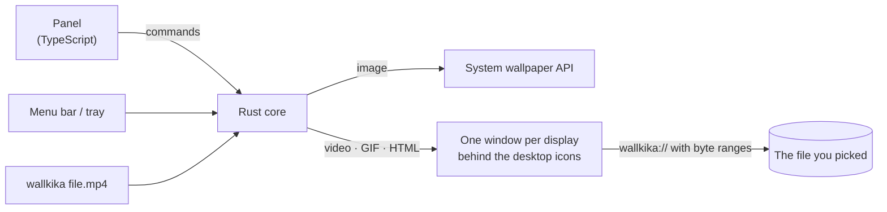

<p align="center">
  
</p>

<h1 align="center">WallKika</h1>

<p align="center">
  <b>One wallpaper, every screen.</b><br>
  Pick an image, a GIF, a video or an HTML page and WallKika puts it behind your desktop icons on every display, looping forever.
</p>

<p align="center">
  
  
  
  
  
</p>

<p align="center">
  
  &nbsp;&nbsp;
  
</p>

## Features

- **Every display, automatically.** Mirrors the wallpaper on all connected screens, including mixed setups (Retina + 1080p). Plug in a monitor and it's covered within 2 seconds.
- **Videos that never stop.** MP4, M4V, MOV and WebM loop forever, muted, behind your icons. A 2-minute clip or a 2-hour file both work: videos are streamed, never loaded into memory.
- **Images at zero cost.** JPG, PNG, HEIC, AVIF, WebP, BMP and TIFF go through the system wallpaper API, so they use no CPU and stay after you quit.
- **GIFs and web pages.** Use a GIF or any HTML page (a clock, a shader, a dashboard) as a live wallpaper. Pages run sandboxed.
- **Stays out of the way.** Menu bar / tray controls, drag and drop, and a CLI (`wallkika video.mp4`). Closing the panel keeps it running, and the last live wallpaper comes back on startup.
- **Light on resources.** About 25 MB of RAM for the core and roughly 12% of one CPU core for a 1080p video on two displays (Apple M2).

## Status: v0.1.0 preview

| Platform | Static images | Live wallpapers | Tested on real hardware |
| --- | --- | --- | --- |
| macOS 13+ | ✅ | ✅ | ✅ macOS 27, Apple M2, two displays with mixed DPI |
| Windows 10 / 11 (incl. 24H2) | 🧪 | 🧪 | Not yet: compiles cleanly, needs testers |
| Linux (GNOME, KDE, XFCE, Cinnamon, MATE, LXQt, Sway, Hyprland…) | 🧪 | 🧪 X11 / XWayland | Not yet: compiles cleanly, needs testers |

Windows and Linux testers are very welcome. See [Contributing](#contributing).

## How it works



Static images use the native API of each system: `NSWorkspace` on macOS, `IDesktopWallpaper` on Windows, and `gsettings`, `plasma-apply-wallpaperimage`, `xfconf-query`, `swww` or `feh` on Linux, depending on the desktop.

Live wallpapers are borderless webview windows, one per display, placed where the desktop wallpaper lives:

- **macOS**: the CoreGraphics desktop window level, on every Space, ignoring the mouse.
- **Windows**: reparented into Explorer's `WorkerW` on the classic desktop, or into `Progman` just below the icons on the 24H2+ desktop.
- **Linux**: X11 windows of type `_NET_WM_WINDOW_TYPE_DESKTOP`; Wayland sessions run through XWayland.

Media reaches those windows through a custom `wallkika://` protocol that serves exact byte ranges. That lets huge videos stream smoothly.

## Install

There are no signed builds yet, so build it from source:

1. Install [Node.js](https://nodejs.org) 20+, [Rust](https://rustup.rs) and the [Tauri prerequisites](https://v2.tauri.app/start/prerequisites/) for your system. The Rust version is pinned in `rust-toolchain.toml` and rustup installs it automatically.
2. On Linux, also install the GStreamer plugins for video: `gstreamer1.0-plugins-good`, `gstreamer1.0-plugins-bad` and `gstreamer1.0-libav`.
3. Build:

```bash
git clone <this repository>
cd WallKika
npm install
npm run tauri build
```

The app ends up in `src-tauri/target/release/bundle/` (`.app` on macOS, `.msi`/`.exe` on Windows, `.deb`/`.AppImage`/`.rpm` on Linux).

## Usage

- **Panel**: click **Choose file…** or drop a file on the window.
- **Menu bar / tray**: choose a wallpaper, stop the live wallpaper, or quit.
- **Command line**: `wallkika /path/to/video.mp4` sends the file to the running instance.

Settings live in the app config folder (`~/Library/Application Support/com.cristiandjr.wallkika/` on macOS). Logs are in `~/Library/Logs/com.cristiandjr.wallkika/`.

## Project structure

```
src/
  panel/                control panel (HTML, CSS, TypeScript)
  wallpaper/            renderer loaded in every per-display window
  shared/api.ts         typed bridge to the Rust commands and events
src-tauri/src/
  engine.rs             decides native vs live, manages per-display windows
  display.rs            display list and hot-plug watcher
  protocol.rs           wallkika:// media protocol (byte ranges + allowlist)
  platform/             macos.rs · windows.rs · linux.rs
  commands.rs · tray.rs · settings.rs · media.rs · error.rs
scripts/
  cross-check.sh        lints the Windows and Linux backends from any OS
  macos/                debugging helpers (window levels, current wallpaper)
```

## Security

- Wallpaper windows can only read files you picked, plus the folder of an HTML wallpaper, through `wallkika://`. Everything else is rejected.
- HTML wallpapers run in a sandboxed iframe with no access to the app API.
- Strict Content Security Policy, minimal Tauri permissions, no remote content, no telemetry.

## Roadmap

- [ ] Every video format (MKV, AVI, WMV, FLV…) through automatic ffmpeg remuxing or transcoding
- [ ] Testing on Windows and Linux hardware
- [ ] Signed and notarized releases with auto-update
- [ ] Launch at login
- [ ] A different wallpaper per display, and fit modes (cover, contain, stretch)
- [ ] Playlists and schedules
- [ ] Pause while a fullscreen app is active or on battery
- [ ] Native decoders (AVPlayer, Media Foundation, mpv) that decode once for all displays
- [ ] Wayland layer-shell support
- [ ] Spanish UI

## Contributing

Issues and pull requests are welcome, especially from Windows and Linux users.

```bash
npm install
npm run tauri dev                                         # run in development
cd src-tauri && cargo fmt && cargo clippy --all-targets && cargo test
npm run build && npm run check:cross                      # frontend + Windows/Linux lint
```

Code style: English everywhere, self-explanatory names, and comments only when something is truly non-obvious (one line).

## Support the project

If WallKika is useful to you, you can support its development:

- **Mercado Pago** (Argentina) · alias **`cristiandjr.mp`**

## License

[MIT](LICENSE) © 2026 cristiandjr
