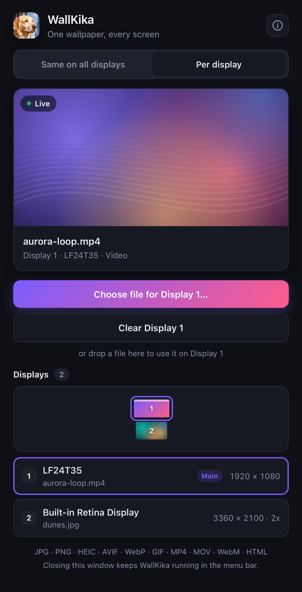
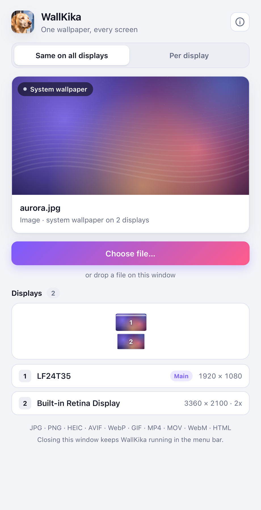
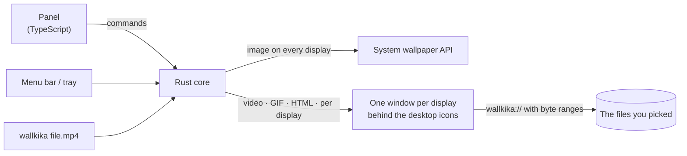

<p align="center">
  <b>English</b> · <a href="README.es.md">Español</a>
</p>

<p align="center">
  
</p>

<h1 align="center">WallKika</h1>

<p align="center">
  <b>One wallpaper, every screen.</b><br>
  Pick an image, a GIF, a video or an HTML page and WallKika puts it behind your desktop icons: the same on every display, or a different one on each.
</p>

<p align="center">
  
  
  
  
</p>

<p align="center">
  <a href="../../releases/latest/download/WallKika-macOS.zip"></a>
  <a href="../../releases/latest/download/WallKika-Windows-x64.zip"></a>
  <a href="../../releases/latest/download/WallKika-Linux-x86_64.zip"></a>
</p>

<p align="center">
  <sub>No installer: download the zip, open the app inside, done. macOS universal (Apple Silicon + Intel) · Windows 10/11 x64 · Linux x86_64 · <a href="../../releases">all releases</a></sub>
</p>

<p align="center">
  
  &nbsp;&nbsp;
  
</p>

## What WallKika can do

- [x] The same wallpaper on every display, or a different one on each display
- [x] Images (JPG, PNG, HEIC, AVIF, WebP, BMP, TIFF) through the system wallpaper API, at zero cost
- [x] Videos (MP4, M4V, MOV, WebM) looping forever and muted, from 2-minute clips to 2-hour files (streamed, never loaded into memory)
- [x] GIFs and HTML pages (clocks, shaders, dashboards) as live wallpapers, sandboxed
- [x] Mixed setups (Retina + 1080p) and hot-plug: a new monitor is covered within 2 seconds
- [x] Runs in the background: closing the window leaves WallKika in the menu bar / system tray, out of Cmd+Tab, Alt+Tab, the Dock and the taskbar
- [x] Remembers your wallpapers between restarts
- [x] Drag and drop, plus a command line: `wallkika file`, `--display N`, `--background`
- [x] Tells you in the menu and in the window when a new version is out
- [x] About panel with contact and support details
- [x] Light and dark mode
- [x] Portable downloads for macOS, Windows and Linux
- [ ] Every video format (MKV, AVI, WMV, FLV…) through automatic ffmpeg conversion
- [ ] Launch at login
- [ ] Fit modes (cover, contain, stretch), playlists and schedules
- [ ] Pause while a fullscreen app is active or on battery
- [ ] Signed releases (Apple notarization, Windows code signing)
- [ ] Native decoders that decode a video once for all displays
- [ ] Wayland layer-shell support and a Spanish UI

## Download

WallKika is portable: there is nothing to install. Every download is a zip with the app inside. Grab the file for your system from the buttons above or from [Releases](../../releases).

| System | File | First run |
| --- | --- | --- |
| macOS 13+ | `WallKika-macOS.zip` | Unzip and open `WallKika.app`. Move it to **Applications** if you want to keep it. The app isn't notarized by Apple yet: if macOS blocks it, go to **System Settings → Privacy & Security → Open Anyway**. |
| Windows 10 / 11 | `WallKika-Windows-x64.zip` | Unzip and run `WallKika.exe`, then pin it to the taskbar or Start if you like. SmartScreen may warn about an unknown publisher: **More info → Run anyway**. Needs Microsoft Edge WebView2, which Windows 11 and up-to-date Windows 10 already include. |
| Linux | `WallKika-Linux-x86_64.zip` | Unzip and run `WallKika.AppImage` (if your file manager drops the permission, `chmod +x WallKika.AppImage`). Some distributions need `libfuse2` to open AppImages. |

## Status: v0.2.0 preview

| Platform | Static images | Live wallpapers | Tested on real hardware |
| --- | --- | --- | --- |
| macOS 13+ | ✅ | ✅ | ✅ macOS 27, Apple M2, two displays with mixed DPI |
| Windows 10 / 11 (incl. 24H2) | 🧪 | 🧪 | Not yet: compiles cleanly, needs testers |
| Linux (GNOME, KDE, XFCE, Cinnamon, MATE, LXQt, Sway, Hyprland…) | 🧪 | 🧪 X11 / XWayland | Not yet: compiles cleanly, needs testers |

Windows and Linux testers are very welcome. See [Contributing](#contributing).

## Usage

- **Same on all displays**: choose a file or drop it on the window and every display shows it.
- **Per display**: pick a display in the map or in the list, then choose a file for it. Each display keeps its own wallpaper; displays without one show the system wallpaper.
- **Menu bar / tray**: open WallKika, stop the live wallpapers, see About, download a new version when one is out, or quit. Closing the window only hides it; **Quit** closes WallKika completely.
- **Command line**: `wallkika video.mp4` sets it on every display, `wallkika --display 2 photo.jpg` sets it on display 2, and `wallkika --background` starts or hides WallKika without its window.

Settings live in the app config folder (`~/Library/Application Support/com.cristiandjr.wallkika/` on macOS). Logs are in `~/Library/Logs/com.cristiandjr.wallkika/`.

## How it works



Static images on every display use the native API of each system: `NSWorkspace` on macOS, `IDesktopWallpaper` on Windows, and `gsettings`, `plasma-apply-wallpaperimage`, `xfconf-query`, `swww` or `feh` on Linux, depending on the desktop.

Everything else is drawn by borderless webview windows, one per display, placed where the desktop wallpaper lives:

- **macOS**: the CoreGraphics desktop window level, on every Space, ignoring the mouse.
- **Windows**: reparented into Explorer's `WorkerW` on the classic desktop, or into `Progman` just below the icons on the 24H2+ desktop.
- **Linux**: X11 windows of type `_NET_WM_WINDOW_TYPE_DESKTOP`; Wayland sessions run through XWayland.

Each window knows its display through a stable hardware ID, so per-display choices survive rearranging monitors. Media reaches the windows through a custom `wallkika://` protocol that serves exact byte ranges, which lets huge videos stream smoothly. A window that fails to load is recreated automatically.

## Build from source

1. Install [Node.js](https://nodejs.org) 20+, [Rust](https://rustup.rs) and the [Tauri prerequisites](https://v2.tauri.app/start/prerequisites/) for your system. The Rust version is pinned in `rust-toolchain.toml`; run `rustup toolchain install` inside the project to get it.
2. On Linux, also install the GStreamer plugins for video: `gstreamer1.0-plugins-good`, `gstreamer1.0-plugins-bad` and `gstreamer1.0-libav`.
3. Build:

```bash
npm install
npm run tauri dev     # run in development
npm run package       # portable build for your OS, written to release/
```

On macOS, `npm run package` builds a universal app, so it needs both Rust targets: `rustup target add aarch64-apple-darwin x86_64-apple-darwin`. Set `MAC_TARGET=aarch64-apple-darwin` for a faster, Apple Silicon only build.

## Project structure

```
src/
  panel/                control panel (HTML, CSS, TypeScript)
  wallpaper/            renderer loaded in every per-display window
  shared/api.ts         typed bridge to the Rust commands and events
src-tauri/src/
  engine.rs             applies wallpapers and manages one window per display
  layout.rs             mirror vs per-display model
  display.rs            display list, stable IDs and hot-plug watcher
  protocol.rs           wallkika:// media protocol (byte ranges + allowlist)
  updates.rs            new-version notice (GitHub releases)
  platform/             macos.rs · windows.rs · linux.rs
  commands.rs · tray.rs · settings.rs · media.rs · error.rs
scripts/
  package.sh            portable build for the current OS
  cross-check.sh        lints the Windows and Linux backends from any OS
  macos/                debugging helpers (window levels, current wallpaper)
.github/workflows/
  release.yml           builds all platforms and publishes a GitHub release
```

## Security

- Wallpaper windows can only read files you picked, plus the folder of an HTML wallpaper, through `wallkika://`. Everything else is rejected.
- HTML wallpapers run in a sandboxed iframe with no access to the app API.
- Strict Content Security Policy and minimal Tauri permissions. No telemetry.
- WallKika itself makes a single network request: a check of this repository's latest GitHub release, at launch and every 12 hours. The update link only opens release pages of this repository. HTML wallpapers you add may load their own content.

## Contributing

Issues and pull requests are welcome, especially from Windows and Linux users.

```bash
npm install
npm run tauri dev                                         # run in development
cd src-tauri && cargo fmt && cargo clippy --all-targets && cargo test
npm run build && npm run check:cross                      # frontend + Windows/Linux lint
```

Code style: English everywhere, self-explanatory names, and comments only when something is truly non-obvious (one line).

### Releasing

1. Bump `version` in `package.json` and `src-tauri/Cargo.toml`.
2. Push a tag: `git tag v0.2.0 && git push origin v0.2.0`.
3. The [Release workflow](.github/workflows/release.yml) builds macOS, Windows and Linux and publishes them on the Releases page. The download buttons always point to the latest release, and running copies of WallKika announce it.

## Author

Made by **Cristian** · [github.com/cristiandjr](https://github.com/cristiandjr) · ideas and suggestions: cristiandjr89@gmail.com

## Support the project

If WallKika is useful to you, you can support its development:

- **Mercado Pago** (Argentina) · alias **`cristiandjr.mp`**

## License

[MIT](LICENSE) © 2026 cristiandjr
